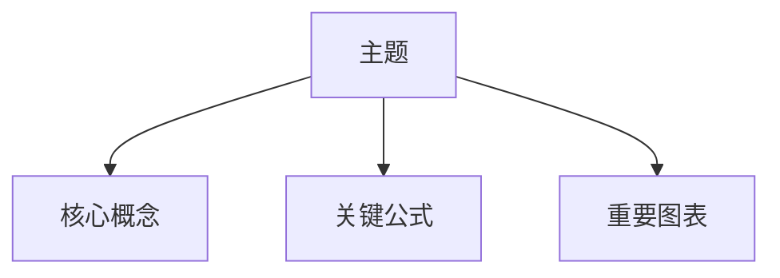

# 中文图文学习笔记模板

Use this template when creating notes with `$study-literature-notes`. Keep the final note concise, evidence-backed, and useful for later review. Remove empty sections that truly do not apply, but do not add review questions or follow-up study advice by default.

````markdown
# 标题

> 来源：文件名 / 章节或分块 / 页码、幻灯片或段落范围
> 审计结论：fits | borderline | oversize | unreadable-selected-range
> 规划结构：bookmarks | toc | headings | paper_sections | auto_chunks；置信度 high | medium | low
> 说明：本笔记基于可抽取文本与可定位图表线索整理；未使用 OCR；输出为 Markdown。

## 0. 章节/分块规划说明

- 当前内容单元：chapter / section / slide_group / auto_chunk
- 标题：...
- 范围：p. / slide / paragraph
- 估算 tokens：...
- 若置信度为 `low`，必须写明：未识别可靠章节结构，本内容为自动分块，不代表原文真实章节。

## 1. 知识框架



简要说明框架如何对应原文结构，并标注主要来源页码、章节或段落。

## 2. 核心概念

| 概念 | 精确定义 | 作用 | 来源 |
| --- | --- | --- | --- |
|  |  |  | p. |

## 3. 关键结论

- **结论**：...
  - 依据：...
  - 来源：p.
  - 不确定性：无 / 推断 / 需要原图或 OCR

## 4. 重要公式与推导

### 公式：名称

- 来源：p.
- 原式：

```text
...
```

- 符号：

| 符号 | 含义 | 单位/约束 |
| --- | --- | --- |
|  |  |  |

- 适用条件：...
- 关键推导：
  1. ...
  2. ...
  3. ...
- 补充推导：若有不是原文直接给出的步骤，在这里明确标注。
- 直观含义：...

## 5. 重要图表线稿

### 图：名称

- 来源：p. / slide
- 原图类型：流程图 / 结构图 / 坐标图 / 表格 / 对比图 / 其他
- 复刻性质：学习用简化线条图，不是原图细节复制。

```text
+------------------+
|                  |
|   简化线稿区域   |
|                  |
+------------------+
```

解释：...

## 6. 术语表

| 术语 | 中文解释 | 原文语境 | 来源 |
| --- | --- | --- | --- |
|  |  |  | p. |

## 7. 易混点

| 易混点 | 容易误解的原因 | 正确理解 | 来源 |
| --- | --- | --- | --- |
|  |  |  | p. |

## 8. 证据表

| 编号 | 笔记中的观点/公式/图解 | 证据位置 | 证据类型 | 备注 |
| --- | --- | --- | --- | --- |
| E1 |  | p. | 原文 / 表格 / 图注 / 推断 |  |

## 9. 未解决问题

- ...
````

## Rules

- Keep source anchors close to claims, formulas, and visuals.
- Use `推断` for interpretations not directly stated by the source.
- Use `补充推导` for derivation steps added by the model.
- For Mermaid diagrams, include an ASCII fallback when the diagram represents an important source visual.
- Do not add review questions, future study suggestions, or PDF output unless the user explicitly asks.
